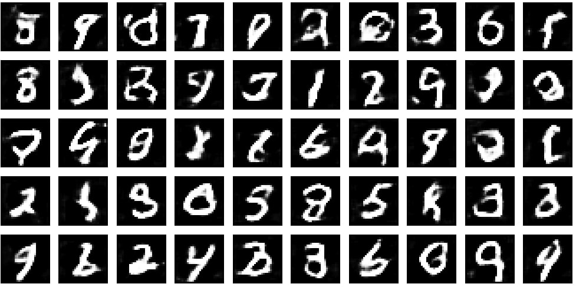

# MNIST GAN Image Generator

This repository contains a Generative Adversarial Network (GAN) implemented in TensorFlow and Keras to generate realistic handwritten digits similar to the MNIST dataset.

## 🚀 Features
- **Generator**: Creates 28x28 grayscale digit images from random noise.
- **Discriminator**: Distinguishes between real MNIST images and generated ones.
- **Training Loop**: Alternates between updating the discriminator and the generator to improve performance.
- **Visualization**: Saves generated images at regular intervals to monitor training progress.

## 📦 Installation

1. Clone the repository:
   ```bash
   git clone https://github.com/Vamsi404/mnist-gan-image-generator.git
   ```
2. Install required packages:
   ```bash
   pip install -r requirements.txt
   ```

## 🏃‍♂️ Usage

1. Run the training script:
   ```bash
   python train_gan.py
   ```
2. Generated images will be saved in the `images` directory, and model checkpoints in the `models` directory.

## 📸 Example Output




## 🔗 Links

- [Original GAN paper](https://arxiv.org/abs/1406.2661)
- [MNIST dataset](http://yann.lecun.com/exdb/mnist/)
